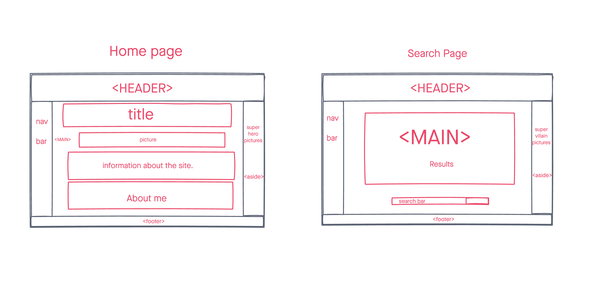

# Super Information

a simple web application that displays super hero and villain information using a superhero api

## Techonolgies Used

- HTML5
- CSS3
- jQuery
- JavaScript
- Google Fonts
- Superhero API

## Screenshots

## Getting started

[Click here](https://super-information.vercel.app/) to see the deployed app!

## Future Enhancements

- The ability to generate random hero/villain information!
- mobile optimization
- add more design to the page
- add contact page 

## Explanation

- Used JavaScript with jQuery to add interactions such as inputting a name of a character to display the information. 

- Used HTML to add multiple pages and to inform the audience of the site.

- Used CSS to style the pages.

## Approach

I design the wireframe so that I can follow a path of how I wanted the site to look. I used the HTML to out my ideas and CSS to style those ideas of how I wanted it to look.